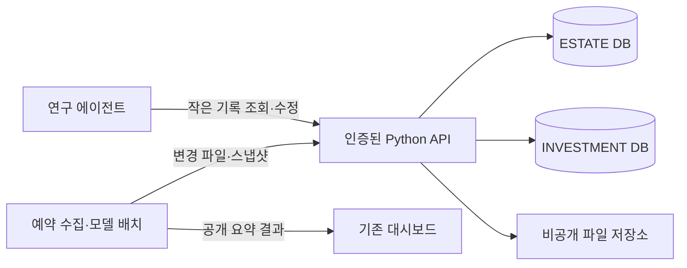

# 두 프로젝트의 Oracle 백엔드

부동산 `jaesung0804/turbo-potato`와 투자 `jaesung0804/st_dashboard`의 연구 기록과 대용량 상태를 Git 밖에 보관하는 Python 서비스다. Oracle DB 연결, 프로젝트별 인증, 버전 관리, 파일 저장소, 증분 이관 CLI와 두 저장소용 연결 패치를 포함한다.

**현재 상태:** 두 Oracle Always Free DB와 비공개 OCI 파일 저장소를 실제 연결하고, Ubuntu 서버에 HTTPS API를 배포했다. 두 프로젝트의 최신 고정 스냅샷을 이관·복원 검증했으며, 투자 기준 JSON 10개와 개별 연구 기록 112개도 운영 DB에 저장했다. GitHub 운영 모드 전환은 연결 코드 반영과 함께 별도로 진행한다. 전체 행 적재 및 최종 검증 현황은 배포 묶음의 `CLOUD-STATUS.md`를 따른다.

## 저장 구조



- 각 프로젝트는 별도 DB와 별도 API 토큰을 사용한다. 한 프로젝트 토큰으로 다른 프로젝트를 읽을 수 없다.
- 에이전트·과제·연구·회의·결정·실험은 `research_records`에 개별 JSON으로 저장한다. 목록은 요약만 반환하고 상세 내용은 선택한 기록에서 읽는다.
- 실거래·주가 이력은 `observations`에 월별 데이터셋과 불변 버전으로 저장한다. 종목/단지, 지역, 날짜 인덱스로 필요한 행만 조회한다.
- 사진, 원본 CSV, 응답 파일, 모델은 파일 저장소에 SHA-256 키로 저장한다. DB에는 크기·해시·경로·버전만 둔다. base64 사진을 DB JSON에 넣지 않는다.
- `snapshot_heads`는 검증이 끝난 전체 파일 목록만 가리킨다. 업로드 도중 실패하면 이전 스냅샷이 계속 보인다. 오래된 작업자의 덮어쓰기는 HTTP 409로 차단한다.
- 투자 배치는 기존의 검증된 압축 아카이브·분할 파일을 백엔드에 저장한다. 부동산 지역별 원본 파티션은 월별 아카이브로 전송한다. 수만 건의 작은 응답 파일을 매번 개별 객체 요청으로 복원하는 것을 피한다. 기존 검증기가 복원된 원본을 다시 확인한다.
- 작업 큐는 만료 가능한 소유권과 재시도 횟수를 관리한다. 월별 행 worker는 수집 배치가 저장한 변경 월만 적재한다. 원본 snapshot과 작업 소유권을 게시 직전 다시 확인하므로 오래된 worker가 최신 DB를 덮어쓰지 않는다. API 조회가 수집·모델 재학습·LLM 실행을 시작하지 않는다.

## 로컬 실행

Python 3.12 이상을 사용한다. Oracle Instant Client는 필요하지 않다. Python 드라이버의 Thin 모드를 쓴다.

```powershell
python -m venv .venv
.venv/Scripts/python.exe -m pip install -e ".[test,oci]"
.venv/Scripts/python.exe -m research_backend.cli init-local --output backend.env --data-dir runtime
.venv/Scripts/python.exe -m research_backend.cli --env-file backend.env init-db
.venv/Scripts/python.exe -m research_backend.cli --env-file backend.env check
.venv/Scripts/python.exe -m research_backend.cli --env-file backend.env serve
```

`init-local`은 프로젝트별 임의 토큰을 비공개 설정 파일에 만들며 화면에 출력하지 않는다. 이미 있는 설정 파일은 덮어쓰지 않는다. 기본 API 주소는 `http://127.0.0.1:8787`, API 명세는 `/openapi.json`이다. 설정·토큰·Wallet·런타임 데이터는 Git에 넣지 않는다.

## Oracle 연결 준비

1. 홈 리전에 Always Free Transaction Processing DB 두 개를 만든다. 표시 이름 `estate-research`, `investment-research`, DB 이름 `ESTATE`, `INVESTMENT`. **Always Free가 켜졌는지 확인**한다. 유료 Developer/자동 확장을 선택하지 않는다.
2. 현재 관리 PC IP만 허용하고 mTLS를 유지한다. 실제 서버를 마련하면 그 서버의 고정 출구 IP도 명시적으로 추가한다. GitHub Actions는 Python API에 연결하므로 DB에 Actions 전체 IP 대역을 열 필요가 없다.
3. ADMIN 비밀번호는 Oracle 화면에서 직접 설정한다. 각 DB의 Database connection에서 Instance Wallet을 내려받아 별도 비공개 디렉터리에 푼다. Wallet 비밀번호도 직접 정한다.
4. 각 DB에 애플리케이션 사용자 `ESTATE_APP` / `INVESTMENT_APP`를 생성한다. `CREATE SESSION`, `CREATE TABLE` 및 DATA 테이블스페이스의 정해진 quota만 부여한다. 백엔드에 ADMIN을 상시 사용하지 않는다. `deploy/application-user.sql`은 사용자가 실행할 템플릿이다.
5. `.env.example`을 비공개 설정 파일로 복사하고 `BACKEND_DATABASE=oracle`, 프로젝트별 사용자·비밀번호·DSN·Wallet 경로·Wallet 비밀번호를 채운다. DSN은 Wallet의 실제 `*_low` 이름을 쓴다. DB 이름만으로 DSN을 추정하지 않는다.
6. `init-db` → `check` 순서로 스키마를 만들고 연결을 확인한다. `oracle-schema.sql`은 같은 스키마의 검토용 SQL이다. 둘 중 한 방식만 사용한다.

Oracle 계정 로그인만으로 로컬 Python에 DB 접속 권한이 생기지는 않는다. Wallet과 DB 사용자의 연결 정보가 필요하다. 비밀번호나 Wallet을 채팅에 붙여 넣지 않는다.

## 사진과 원본 파일

로컬 검증은 `BACKEND_BLOB_STORE=local`로 진행한다. 운영에서는 비공개 OCI Object Storage Standard 버킷 하나를 만들고 다음을 설정한다.

```dotenv
BACKEND_BLOB_STORE=oci
OCI_NAMESPACE=<콘솔에 표시된 namespace>
OCI_BUCKET=research-artifacts
OCI_CONFIG_FILE=/run/secrets/oci-config
OCI_PROFILE=DEFAULT
```

OCI VM에서 실행할 때는 해당 버킷의 객체 읽기·생성에만 권한을 둔 instance principal을 사용하고 `OCI_USE_INSTANCE_PRINCIPAL=true`로 설정할 수 있다. 버킷 공개 접근과 익명 URL은 사용하지 않는다. 이 서비스는 사진을 인증된 첨부파일 다운로드로 제공한다.

DB의 `stored_files`는 저장소 종류를 기록한다. 기존 로컬 DB 설정만 OCI로 바꾸면 파일이 자동 이관되지 않는다. 운영 DB에는 원본에서 다시 이관하거나, 모든 객체를 검증해서 복사한 후 별도로 저장소 메타데이터를 전환해야 한다.

## 데이터 이관

먼저 최신 Git 상태를 별도의 이관 디렉터리에 복원하고 기존 프로젝트 검증기를 통과시킨다. 오래된 로컬 CSV를 최신 클라우드 상태 위에 올리지 않는다.

```powershell
# 투자 조직·과제·정책·회의 등 알려진 10개 JSON 원본과 개별 연구 기록
python -m research_backend.cli --env-file backend.env migrate-investment --root <최신-investment-checkout>

# 실거래와 주가: 전체 파일은 한 번 스트리밍으로 읽고 월별로 이관
python -m research_backend.cli --env-file backend.env import-data --project estate --dataset trades/capital-area --path <검증된-실거래.csv> --monthly
python -m research_backend.cli --env-file backend.env import-data --project investment --dataset prices/kr --path <검증된-국내주가.csv> --monthly
python -m research_backend.cli --env-file backend.env import-data --project investment --dataset prices/us --path <검증된-미국주가.csv> --monthly
```

변경이 없는 월은 다시 DB에 쓰지 않는다. 동일한 금액·날짜의 실거래가 두 건 존재할 수 있으므로 행을 임의로 중복 제거하지 않는다. 실패한 이관 버전은 공개되지 않으며 같은 원본으로 재실행하면 커밋된 배치 다음부터 이어서 처리한다. 월별 worker는 기본 500행씩 커밋한다. 운영자가 초기 적재를 조절할 때 `import_rows(..., batch_size=50)`처럼 1~500 범위로 줄일 수 있다. 빠진 월을 삭제하지 않는다.

월별 이관은 매 실행마다 입력 CSV를 읽어 해시를 계산한다. 기존 모델 계산은 필요한 전체 로컬 상태를 복원할 수 있다. **이번 변경이 모든 모델 학습을 SQL 기반으로 다시 구현한 것은 아니다.** 에이전트 조회와 웹 조회에서 대용량 입력을 반복 수집하는 경로를 분리하고 Git 저장을 백엔드로 바꾸는 단계다.

## 에이전트의 작은 기록 조회

실행 환경에 `RESEARCH_BACKEND_URL`과 해당 프로젝트의 `RESEARCH_BACKEND_TOKEN`을 설정한다. 토큰을 프롬프트·명령 인자·공개 JavaScript에 넣지 않는다.

투자 저장소에서:

```powershell
python scripts/backend_records.py list --kind agents --limit 20
python scripts/backend_records.py get --kind research --key <record-key>
python scripts/backend_records.py put --kind research --key <record-key> --input <새-내용.json> --expected-version 3 --summary "이번 분석 요약"
```

부동산 저장소는 동일한 명령의 스크립트 경로가 `backend_records.py`다. 새 기록의 `expected-version`은 0이고, 수정은 직전에 읽은 버전을 사용한다. 409면 최신 내용을 다시 읽고 병합한다. 전체 연구 라이브러리를 매 대화에 다운로드하지 않는다.

ChatGPT 프로젝트에는 DB 연결이 자동 추가되지 않는다. 해당 프로젝트에서 실행되는 코드 환경에 API 주소·비공개 토큰을 설정하고 이 클라이언트를 사용할 수 있어야 한다. 일반 대화의 텍스트 메모만으로 실행 환경에 비밀값을 전달하지 않는다.

## 두 GitHub 저장소 전환

동봉된 연결 패치는 다음 커밋을 기준으로 작성했다.

| 저장소 | 기준 커밋 | 변경 |
|---|---|---|
| turbo-potato | b2a92f8 | 5개 워크플로의 상태 저장 경로, 백엔드 클라이언트, 부동산 로컬 서버의 명시적 `--rebuild` |
| st_dashboard | 4413b018 | 공용 pack/unpack/push와 관련 워크플로, 백엔드 기록 클라이언트 |

기존 작업 폴더와 Git 데이터 이력은 보존했다. 최신 main이 이동했다면 패치를 적용하기 전 차이를 검토한다.

전환 순서:

1. HTTPS API를 운영 서버에 배포하고 프로젝트별 `ready`를 확인한다. 로컬 API 주소는 GitHub Actions에서 접근할 수 없다.
2. 기존 최신 Git 상태를 검증한 후 초기 스냅샷을 업로드한다. 투자 `pipeline-state`, 부동산 `estate-raw-state`, `estate-model-state`, `estate-potential-state`, `estate-history-state`, `estate-history-extended-state`를 실제 워크플로에서 사용하는 상태와 대조한다.
3. 빈 별도 폴더로 전부 복원하고 파일 수·크기·해시와 기존 검증기를 확인한다. 투자에서는 `unpack_dashboard_state.py`, 부동산에서는 `backend_state.py pull` 뒤 해당 raw/model 복원 명령을 사용한다. 데이터셋 이관 후 행 수와 날짜 범위를 비교한다.
4. 각 저장소에 비밀값 `RESEARCH_BACKEND_TOKEN`, 변수 `RESEARCH_BACKEND_URL`을 저장하고 연결 코드를 반영한다.
5. 예약 배치가 돌지 않는 시점에 최종 동기화한 뒤 변수 `RESEARCH_STORAGE=backend`로 전환한다. 그 전까지는 기존 Git 방식이 기본이다.
6. 배치 한 번을 실행해 백엔드 스냅샷 저장과 공개 대시보드 산출물을 확인한다.

초기 스냅샷 예시:

```powershell
# RESEARCH_BACKEND_URL / TOKEN은 비공개 실행 환경에서 공급
# 투자: 검증하여 복원한 프로젝트 폴더에서 기존 기본 경로를 사용
python scripts/pack_dashboard_state.py --state-dir .dashboard-state
# 부동산: 기존 pack 명령으로 검증된 상태 폴더를 사용
python backend_state.py push --name estate-raw-state --state-dir <검증된-raw-state-folder>
```

위 투자 예시는 `RESEARCH_STORAGE=backend`를 해당 이관 프로세스에만 설정한 뒤 실행한다. 전체 저장소나 사용자 문서 폴더를 이관 대상으로 지정하지 않는다. 별도 파일은 클라이언트의 `push --paths`에 실제 경로를 명시한다. 클라이언트는 `.git`, `.env*`, 심볼릭 링크, 경로 이탈을 거부한다. 최초 업로드 이후에는 항상 `pull` → 업무 변경 → `push` 순서다.

투자의 오래된 특정 Git 복구 워크플로는 backend 모드에서 실행되지 않는다. 부동산 PR 검증용 `validate-estate.yml`의 읽기 전용 Git 검증은 그대로다. 공개 Pages 결과와 짧은 진단용 Actions 아티팩트는 기존 방식으로 유지한다.

## 운영·복구 경계

- API 목록은 최대 200개, 기본 응답 예산은 256 KiB다. 단일 기록 JSON은 최대 128 KiB다. 큰 원본은 파일 API로 나누어 다룬다.
- Oracle 연결 풀은 프로세스당 DB별 3개로 제한한다. 무작정 프로세스/에이전트 수를 늘리지 않는다.
- 스냅샷 공개는 DB 트랜잭션으로 처리한다. 로컬 복원은 변경 파일을 모두 검증한 뒤 파일별로 교체하므로 OS 중단 시 디렉터리 전체가 한 번에 교체되는 것은 아니다. 재실행해 복원을 완료하고 검증 후 계산한다.
- 원본 파일·스냅샷·연구 기록·현재 월별 head는 보존한다. `RESEARCH_ROW_RETENTION=true`로 설정한 worker만 게시 성공 후 이전 SQL 복제행을 작은 배치로 정리한다. 실제 원본 객체의 SHA와 크기를 먼저 검증하며, 버전 metadata에는 source SHA·format·원래 행 수·archived 상태를 남긴다. 기본값은 false다. 정리 중 실패해도 현재 head를 유지한다. Oracle DELETE가 할당된 segment 크기를 즉시 줄이지는 않으므로 12 GiB 용량 검사에서 보수적으로 중단될 수 있다.
- `export-records`는 메타데이터 JSONL 백업이다. observations 행과 실제 파일 바이트는 포함하지 않는다. 완전한 복구에는 원본 객체의 별도 복사와 데이터셋 재이관이 필요하다. 자동 전체 백업/복원 기능이 이미 동작한다고 간주하지 않는다.
- backend 모드에서 새 데이터가 쌓인 뒤 단순히 Git 모드로 돌아가면 오래된 상태를 읽는다. 되돌릴 때는 최신 백엔드 상태를 먼저 복원·검증하고 기존 상태 형식으로 옮긴다.
- 실제 운영 서버는 Ubuntu 24.04 ARM, A1 2 OCPU/12 GB RAM/50 GB 디스크다. `deploy/install-ubuntu.sh`와 nginx 설정으로 공개 IP의 HTTPS 인증서를 발급하고 갱신 모의 실행까지 확인했다. 인증서 갱신 타이머는 하루 두 번 확인한다. HTTP는 인증서 검증 파일만 제공하며 API는 HTTPS를 사용한다.
- 서버는 OCI instance principal로 지정한 비공개 버킷만 읽고 쓴다. 설정용 계정 전체 권한의 API 키를 서버에 넣지 않는다. Oracle에는 서버와 관리 PC의 IP만 허용하며 Wallet/mTLS와 앱 계정을 사용한다.

임시 이관 작업은 `OCI_AUTH=security_token`, `OCI_CONFIG_FILE`, `OCI_PROFILE`로 Oracle CLI 세션을 사용할 수 있다. 세션이 만료되거나 갱신되면 실행 중인 클라이언트를 다시 시작한다. 운영 서버는 인스턴스 인증 또는 운영용 제한 권한을 사용한다.

## 두 Oracle DB 연결 도우미

각 DB의 Instance Wallet을 내려받은 뒤 `python -m research_backend.oracle_bootstrap --gui --private-dir .oracle-private`를 실행한다. 기존 ADMIN 및 Wallet 비밀번호를 로컬 창에서 입력하면 앱 계정과 테이블을 병렬로 준비한다. ADMIN 비밀번호는 저장하지 않으며 앱 비밀번호·Wallet은 권한을 제한한 비공개 폴더에 저장한다. 기존 계정의 접속정보가 없으면 비밀번호를 바꾸지 않고 멈춘다. `init-db --project estate` 및 `check --project investment`처럼 한 DB씩 초기화·확인하는 것도 가능하다.

실제 두 DB의 앱 계정·10개 테이블, OCI 원본 보관, HTTPS 서비스와 프로젝트 분리를 검증했다. 투자 조직·과제·회의 등의 producer 4개와 consumer 3개도 API를 사용한다. 관련 문서 포인터와 개별 기록은 `/reference-transactions`에서 함께 커밋하며 stale version은 전체 409다. 최신 이관·운영 상태는 배포 묶음의 `CLOUD-STATUS.md`를 따른다.

`GET /v1/{project}/dataset-version?dataset=...&version=...`은 원본 SHA와 SQL 보관 상태만 반환한다. archived 행 조회는 404이며 조회가 자동 복원이나 새 적재 작업을 만들지 않는다. 명시적인 과거 재현에는 보관된 원본을 사용한다.

월별 worker는 `deploy/research-row-worker@.service`를 사용해 프로젝트별 한 개씩 실행한다. 초기 import와 같은 프로젝트 잠금을 사용한다. 투자 snapshot 저장 6개 workflow와 부동산 raw/history/older/pages 저장 경로가 성공한 저장 receipt를 월별 enqueue에 전달한다. 기존 일별·월별 배치 일정은 유지하며 코드 push만으로 수집·학습을 시작하지 않는다. 부동산 Pages 배포는 예약·수동·정상 연구 작업 후에 실행한다.

## 무료 자원 확인 — 2026-09-11

Oracle Autonomous Always Free는 DB당 20 GB, 최대 두 개를 제공한다. 비활동 7일 후 자동 중지, 중지 상태가 누적 90일이면 회수될 수 있으며 선택한 백업 시점으로 되돌리는 기능은 무료 DB에서 제공하지 않는다. 연결 제한 때문에 작은 풀을 사용한다. [Oracle 공식 DB 제한](https://docs.oracle.com/en/cloud/paas/autonomous-database/serverless/adbsb/autonomous-always-free.html)

Object Storage는 무료 전용 계정에서 티어 합계 20 GB와 월 50,000회 요청이다. 체험/유료 계정은 문서의 티어별 무료 구간도 함께 확인해야 한다. 체험 종료 시 합계 20 GB 초과 데이터가 삭제될 수 있다는 조건이 있다. A1 무료 Compute는 현재 문서 기준 합계 2 OCPU/12 GB이며 리전 용량 부족으로 생성이 실패할 수 있다. 실제 콘솔 한도와 Always Free 표기를 확인하고 유료 업그레이드를 자동 실행하지 않는다. [Oracle 공식 무료 자원](https://docs.oracle.com/en-us/iaas/Content/FreeTier/freetier_topic-Always_Free_Resources.htm)

사진 저장 때문에 MongoDB를 선택할 필요는 없다. 정형 데이터와 JSON 연구 기록을 DB에 두고 파일을 별도 저장하면 DB 용량을 사진이 차지하지 않고, 필요한 기록만 가져오는 방식도 유지할 수 있다.
